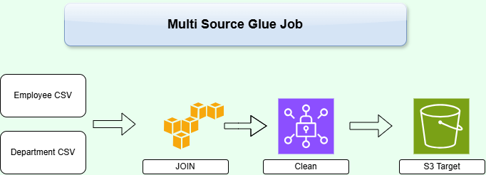

# AWS Glue Multi-Source ETL Pipeline

## Project Overview

This project demonstrates a multi-source ETL (Extract, Transform, Load) pipeline built using AWS Glue and Amazon S3.

The pipeline reads two CSV datasets from Amazon S3, joins the datasets using AWS Glue Visual ETL, performs data cleaning and schema transformation, and stores the processed data back in Amazon S3 in Parquet format.

## Architecture



### Data Flow

Employee CSV + Department CSV → AWS Glue Join → Data Cleaning → Schema Transformation → Amazon S3 Target

## AWS Services Used

- **Amazon S3** - Stores the source CSV files and processed Parquet files.
- **AWS Glue** - Performs the ETL processing.
- **AWS Glue Visual ETL** - Used to visually design the data pipeline.

## Source Data

Two CSV datasets are used in this project.

### Employee Dataset

The employee dataset contains:

- emp_id
- name
- salary
- address
- loc
- email

### Department Dataset

The department dataset contains:

- user
- department
- designation

The source files are available in the [`data`](data/) folder.

## ETL Process

### 1. Extract

The Employee and Department CSV files are stored in separate Amazon S3 source locations.


### 2. Join

Both datasets are loaded into AWS Glue.

An **Inner Join** is performed using:

`emp_id = user`

This combines employee information with the corresponding department and designation information.

### 3. Data Cleaning

After joining the datasets, the pipeline performs cleaning operations.

The `user` field is removed because it represents the same identifier as `emp_id`.

Duplicate employee records are removed using `emp_id`.

### 4. Schema Transformation

The **Change Schema** transformation is used to update the required data types before loading the final dataset.

The salary field is converted to a numeric data type.

### 5. Load

The transformed dataset is written back to Amazon S3 in **Parquet format**.

## AWS Glue Visual ETL Pipeline


The completed pipeline follows:

Employee S3 + Department S3 → Inner Join → Drop Fields → Drop Duplicates → Change Schema → S3 Target

## Successful Job Execution

The AWS Glue job completed successfully.


## Output

The final transformed dataset is stored in the target Amazon S3 location as Snappy-compressed Parquet files.


AWS Glue uses Apache Spark for distributed data processing, so the output can consist of multiple Parquet part files.

## Repository Structure

```text
aws-glue-multi-source-etl/
│
├── README.md
│
├── data/
│   ├── emp_1.csv
│   ├── department.csv
│   └── README.md
│
├── architecture/
│   ├── Multi_source.drawio.png
│   └── README.md
│
└── screenshots/
    ├── 01-raw-source-files.png
    ├── 02-glue-visual-etl.png
    ├── 03-job-succeeded.png
    ├── 04-parquet-output.png
    └── README.md
```

## Key Concepts Demonstrated

- Multi-source ETL pipeline
- Amazon S3 data storage
- AWS Glue Visual ETL
- CSV data processing
- Inner joins
- Data cleaning
- Duplicate removal
- Schema transformation
- Parquet output
- Distributed data processing

## Project Result

The project successfully demonstrates how AWS Glue can combine data from multiple S3 sources, transform and clean the data, and store the processed dataset in an analytics-friendly Parquet format.
